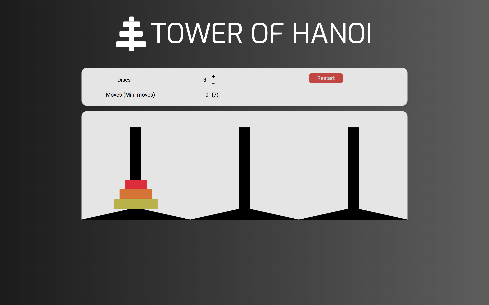

# Hanoi Tower

 This project is a Hanoi Tower browser game built with React, Redux and React DnD.

 Hanoi Tower a mathematical game/puzzle consisting of three rods and a number of disks of different sizes, which can slide onto any rod. The puzzle starts with the disks in a neat stack in ascending order of size on one rod, the smallest at the top, thus making a conical shape.

 The objective of the puzzle is to move the entire stack to another rod, obeying the following simple rules:
    1) Only one disk can be moved at a time.
    2) Each move consists of taking the upper disk from one of the stacks and placing it on top of another stack or on an empty rod.
    3) No larger disk may be placed on top of a smaller disk.

## Feature Highlights
### Drag and Drop - React DnD
As the game allows users to drag and drop a disc from a tower to another each move, the dragging-and-dropping functionality is powered by the React DnD, which is a package that uses the HTML5 drag and drop API under the hood and provides a set of React higher-order components to help build complex drag and drop interfaces while keeping various components decoupled.

### Component-based Design - React

Harnassing the power of React, the application consists of many React components that communicate with each other by dispatching actions to reducers. While it manipulates the data at the Redux store through the reducers, its React components would eventually re-render upon data changes that change the component's state.

### Game Data Storage - Redux
Beside the component-based design, the application stores both game and UI data of the game. 

## Future Implementation
+ Algorithm to solve all puzzles